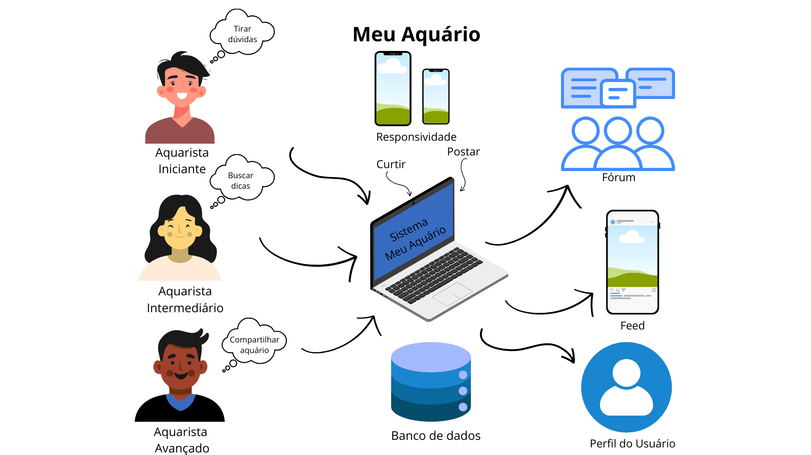
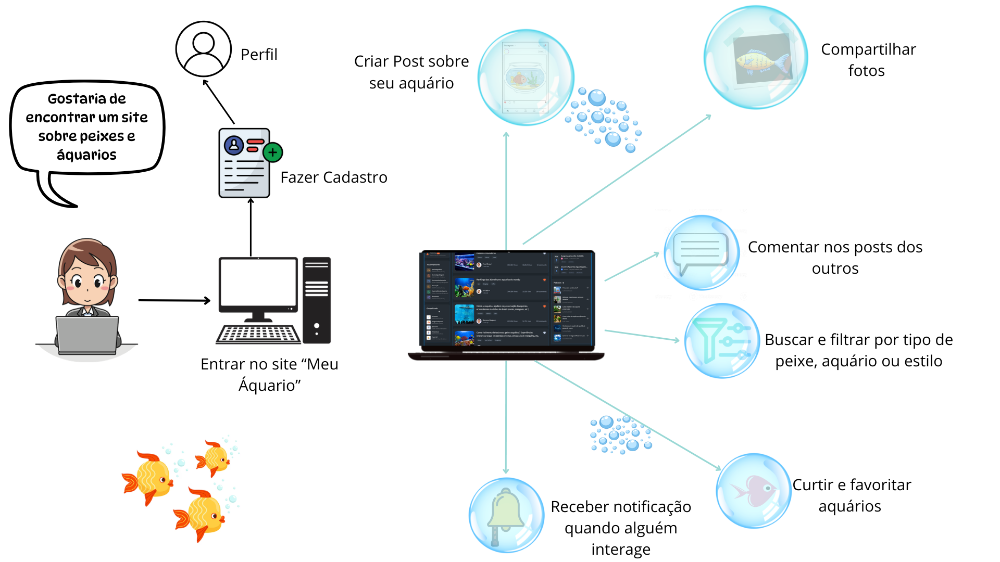
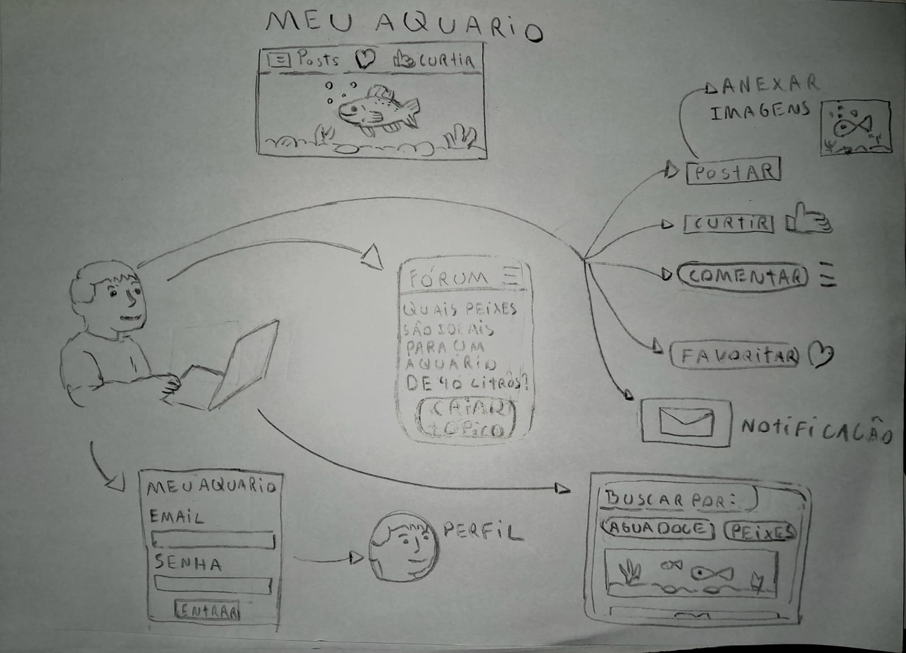

# 1.1.3 Sketch

## Introdução
A etapa "Sketch" do Design Sprint é uma etapa essencial que visa transformar ideias abstratas em representações visuais concretas. Assim, através do Sketch, é possível prototipar, de maneira simples e rápida, uma solução para o problema mapeado na fase de entendimento. No contexto do projeto "Meu Aquário", essa etapa permitiu representar visualmente como o usário pode interagir com a plataforma. 

## Metodologia
Antes da criação do Sketch, os integrantes elaboraram 'Rich Pictures' que auxiliaram no entendimento das ações do usuário, esse processo precedeu à construção de um mapa mental e  diagramas de modelagem e caso de uso, que serviu como base para o levantamento das principais funcionalidades. O Sketch foi construído por meio de papel e lápis e, apesar de também ser entendido como um rich picture, busca representar de forma geral a interação de um entusiasta do aquarismo com o 'Meu Áquario'.

## Rich Pictures

Foram criados dois Rich Pictures que podem ser observados tanto na página dos artefatos generalistas, como logo abaixo: 

  
Primeiro Rich Picture - Rayene Almeida

  

  
Segundo Rich Picture - Pedro Henrique

  

## Sketch 

#### A partir do Sketch acima podemos observar as seguintes interações do usuário:

| Usuário        | Funcionalidades                                                  |
|----------------|------------------------------------------------------------------|
| Entusiasta de Aquarismo      | - Criar tópico   - Fazer login   - Postar   - Curtir   - Comentar   - Favoritar   - Receber notificação   - Buscar   - Filtrar |

| Versão | Alteração| Responsável     | Revisor | Data       | Detalhes da Revisão   |
|--------|--|-----------------|---------|------------|-----------|
| 1.0    | Elaboração inicial do documento    | [Pedro Henrique](https://github.com/PedroHhenriq) |    | 10/04/2025 |  |
| 1.1    | Adição dos Rich Pictures no documento    | [Pedro Henrique](https://github.com/PedroHhenriq) |    | 11/04/2025 |  |
