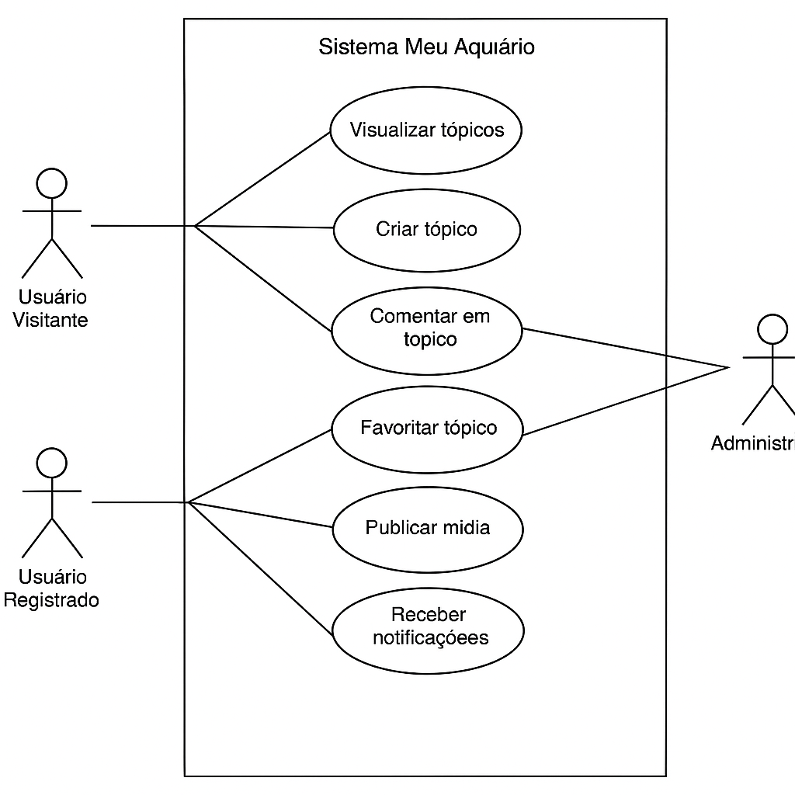

# 1.2.10. Diagrama de Modelagem e Caso de Uso

## 1. Modelagem

A modelagem do sistema "Meu Aquário" foi pensada para atender as principais interações entre os usuários e as funcionalidades do fórum. A seguir, descrevemos os principais **atores** e os **casos de uso** identificados com base nos requisitos levantados:

### Atores do Sistema

- **Usuário Visitante**: Pode visualizar tópicos públicos, mas não pode interagir.
- **Usuário Registrado**: Pode criar tópicos, comentar, favoritar postagens, configurar perfil, etc.
- **Administrador**: Possui permissões para moderar conteúdos, gerenciar usuários e organizar categorias.

## 2. Casos de Uso (Descrição)

| Caso de Uso | Atores Envolvidos | Descrição |
|-------------|-------------------|-----------|
| Cadastrar-se | Visitante | Permite que um novo usuário crie uma conta na plataforma. |
| Fazer login | Visitante | Permite que o usuário acesse funcionalidades restritas. |
| Criar tópico | Usuário Registrado | Cria um novo tópico no fórum. |
| Comentar em tópico | Usuário Registrado | Adiciona uma resposta ou dúvida em um tópico existente. |
| Favoritar tópico | Usuário Registrado | Salva tópicos importantes na conta do usuário. |
| Visualizar tópicos | Todos | Permite navegar pelos tópicos públicos do fórum. |
| Publicar mídia | Usuário Registrado | Anexa imagens e vídeos ao conteúdo do tópico. |
| Receber notificações | Usuário Registrado | Informa sobre novos comentários ou eventos relacionados. |
| Moderar conteúdo | Administrador | Remove ou edita tópicos e comentários inadequados. |
| Gerenciar usuários | Administrador | Bloqueia ou exclui contas que violam regras da comunidade. |

## 3. Diagrama de Casos de Uso (UML - textual)

| Versão | Alteração                  | Responsável     | Revisor | Data       | Detalhes da Revisão                          |
|--------|----------------------------|-----------------|---------|------------|----------------------------------------------|
| 1.0    | Elaboração do documento    | [Maria Eduarda](https://github.com/DudaV228) |     [Rayene Almeida](https://github.com/rayenealmeida)     | 09/04/2025 | Documentação dentro dos padrões esperados  |

