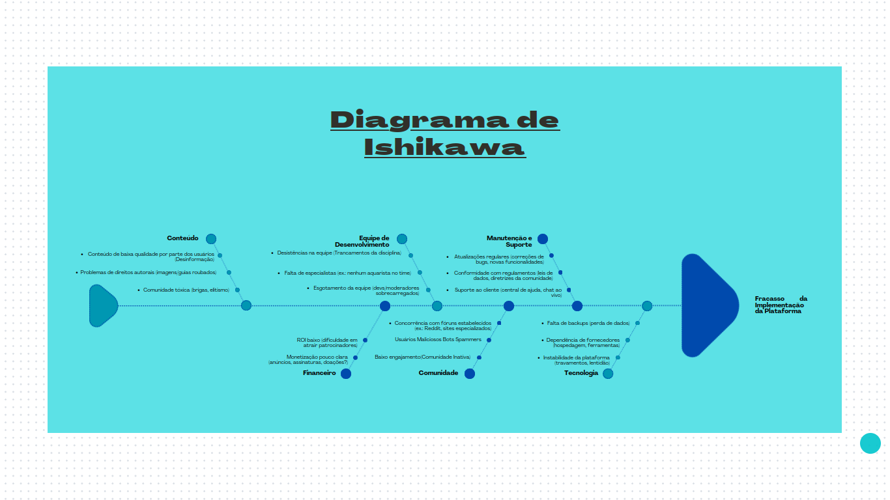

## <a>1. Introdução</a>

A implementação de uma plataforma digital para a comunidade aquarista - o projeto Meu Aquário - envolve desafios complexos que, se não forem adequadamente gerenciados, podem comprometer seu sucesso. Este documento apresenta uma análise abrangente dos principais riscos associados ao desenvolvimento do projeto, organizados em seis eixos críticos:

    Equipe de Desenvolvimento

    Conteúdo

    Financeiro

    Comunidade

    Manutenção e  Suporte:

    Tecnologia

Para cada categoria, identificamos não apenas as ameaças potenciais, mas também estratégias práticas de mitigação.

## <a>2. Metodologia</a>

O **Diagrama de Ishikawa** (também chamado de **Diagrama Espinha-de-Peixe** ou **Diagrama de Causa e Efeito**) é uma ferramenta de análise desenvolvida pelo engenheiro japonês **Kaoru Ishikawa** nos anos 1960.

## 🐟 Principais Características    
 - Formato: Assemelha-se a uma espinha de peixe, com um problema principal na "cabeça" e categorias de causas nas "espinhas".

- Aplicações: Usado em gestão de qualidade, projetos, análise de riscos e solução de problemas em diversas áreas (negócios, TI, saúde, indústria, etc.).

## 🔍 Para que serve?
|Aplicação|	Exemplo|
|---|--|
|Gestão da Qualidade|	Analisar defeitos em produção|
|Gestão de Projetos	|Identificar riscos potenciais|
|Solução de Problemas|	Descobrir causas de falhas|

## <a>3. Causas</a>

### Equipe de Desenvolvimento:
 - Desistências na equipe (Trancamentos da disciplina)
 - Falta de especialistas (ex.: nenhum aquarista no time)
 - Esgotamento da equipe (devs/moderadores sobrecarregados)

### Conteudo:
 - Conteudo de baixa qualidade(desinformação)
 - Problemas de direitos autorais (imagens/guias roubados)
 - Comunidade tóxica (brigas, elitismo)
 

### Financeiro:
 - Monetização pouco clara (anúncios, assinaturas, doações?)
 - ROI baixo (dificuldade em atrair patrocinadores)

### Comunidade :
 - Baixo engajamento(Comunidade Inativa) 
 - Usuários Maliciosos Bots Spammers
 - Concorrência com fóruns estabelecidos (ex.: Reddit, sites especializados)

### Manutenção e  Suporte:
 - Atualizações regulares (correções de bugs, novas funcionalidades)
- Conformidade com regulamentos (leis de dados, diretrizes da comunidade)
 - Suporte ao cliente (central de ajuda, chat ao vivo)

### Tecnologia:
- Falta de backups (perda de dados)
- Dependência de fornecedores (hospedagem, ferramentas)
- Instabilidade da plataforma (travamentos, lentidão)

## <a>4. Quadro Utilizado</a>

## <a>5. Estratégias de Mitigação </a>

### 1. Equipe de Desenvolvimento
|Causa|	Estratégia de Mitigação|
|---|---|
|Desistências	| Dividir tarefas críticas entre múltiplos membros.|
|Falta de especialistas	| Parceria com aquaristas (ex.: convidar moderadores especializados ou consultores).|
|Esgotamento	| Metodologias ágeis (sprints curtos) + ferramentas de gestão (Trello, Jira)|
### 2. Conteúdo
|Causa|	Estratégia de Mitigação|
|---|---|
|Baixa qualidade	| Sistema de curadoria (selo "Verificado por Especialistas").|
|Direitos autorais	| Ferramenta de checagem (ex.: Google Reverse Image Search) + banco de imagens próprio.|
|Comunidade tóxica	| Código de conduta claro + bots de moderação (ex.: AutoModerator)|
### 3. Financeiro
|Risco|	Solução|
|---|---|
| Monetização incerta	| Modelo híbrido: freemium (recursos básicos gratuitos) + assinaturas VIP (conteúdo exclusivo).|
| ROI baixo	| Parcerias com marcas de aquarismo (ex.: patrocínios para tutoriais ou competições).|
### 4. Comunidade
|Desafio|	Ação|
|---|---|
| Baixo engajamento	| Gamificação (medalhas por contribuições) + desafios mensais (ex.: "Aquário da Semana").|
|Bots/Spammers	| Captcha no cadastro + limite de posts para novos usuários.|
|Concorrência	| Diferenciação: foco em nichos (ex.: aquários plantados) + integração com redes sociais.|
### 5. Manutenção e Suporte
|Necessidade|	Implementação|
|---|---|
|Atualizações	| Roadmap público + canal de sugestões (ex.: Discord ou GitHub).|
|Conformidade legal	| Termos de uso transparentes + política de dados (LGPD/GDPR).|
|Suporte ao cliente	| FAQ interativo + chat automatizado para perguntas frequentes.|

### 6. Infraestrutura Tecnológica
| Risco	| Mitigação |
|---|---|
| Falta de backups	| Backup automatizado diário + snapshots semanais |

### Priorização Recomendada:

    Imediato: Moderação (bots + código de conduta) e MVP com funcionalidades essenciais.

    Médio Prazo: Parcerias para monetização e gamificação.

    Contínuo: Treinamento da equipe e atualizações baseadas em feedback.

## <a>Referências Bibliográficas</a>

> <a>1.</a> ISHIKAWA, Kaoru. What is Total Quality Control? The Japanese Way. 1. ed. Englewood Cliffs: Prentice Hall, 1985.

## <a>Histórico de Versão</a>

| Versão | Alteração                  | Responsável     | Revisor | Data       | Detalhes da Revisão |
| -      | -                          | -               | -       | -          | -                   |
| 0.1  |Criação do documento e Adição das seções Metodologia, Causas e Efeitos e do Quadro Utilizado| [Renato Carvalho](https://github.com/Osidious) | pendente| 07/04/2025 | pendente|
| 0.2 |Adição da introdução e das Estratégias de mitigação| [Renato Carvalho](https://github.com/Osidious) | pendente| 10/04/2025 | pendente|