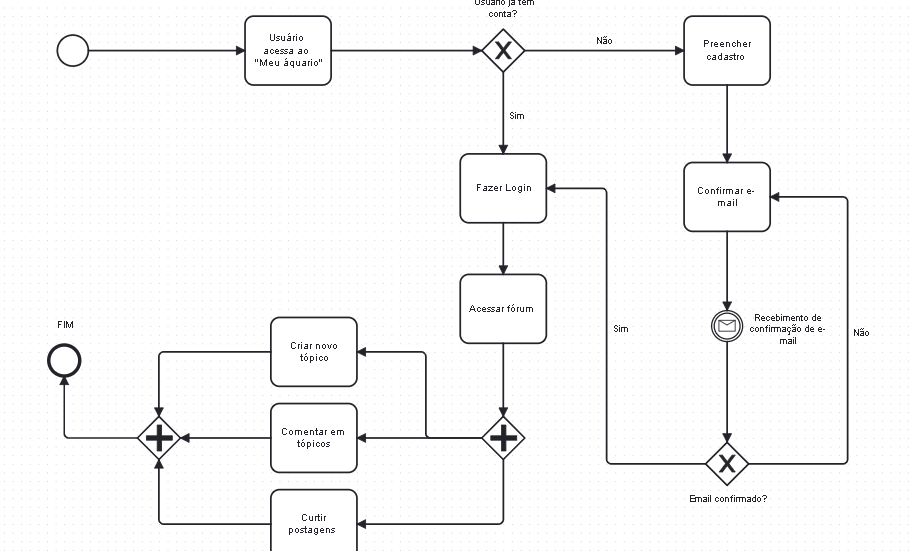

# 1.3.9. BPMN – Eventos

## O que é um Gateway em BPMN?
Em BPMN, um Gateway é um elemento de controle de fluxo que define como o processo seguirá a partir de um determinado ponto, podendo divergir (abrir caminhos diferentes) ou convergir (reunir fluxos que vinham separados). 

## Objetivo
O objetivo da utilização de Gateways na modelagem BPMN é permitir clareza e controle sobre os caminhos alternativos que um processo pode seguir, possibilitando a representação de decisões exclusivas, ações paralelas, ou caminhos múltiplos conforme regras de negócio.

## Características dos Gateways
- Controlam a divergência (ramificação) ou a convergência (junção) do fluxo de sequência

- Não executam tarefas, apenas direcionam o caminho com base em regras ou condições

- São essenciais quando se deseja representar decisões condicionais ou execuções paralelas

#### Os tipos mais comuns de Gateway incluem:
- Exclusivo (XOR): Apenas um dos caminhos será seguido, baseado em uma condição verdadeira

- Inclusivo (OR): Um ou mais caminhos podem ser seguidos, conforme múltiplas condições verdadeiras

- Paralelo (AND): Todos os caminhos são executados simultaneamente, sem avaliar nenhuma condição

- Baseado em Evento: Os caminhos alternativos são seguidos com base em eventos externos ou internos

- Complexo: Permite a definição de condições mais sofisticadas, como “aguardar três de cinco caminhos antes de seguir”

*Visualmente, os Gateways são representados por losangos, com símbolos internos que variam conforme o tipo de controle exercido.*

## Aplicação Prática: 

#### Exemplo Gateway - Acessando o Meu Áquario: 

| Versão | Alteração| Responsável     | Revisor | Data       | Detalhes da Revisão   |
|--------|--|-----------------|---------|------------|-----------|
| 1.0    | Elaboração inicial do documento    | [Pedro Henrique](https://github.com/PedroHhenriq) |    | 10/04/2025 |  |
| 1.1    | Adicionando exemplo prático    | [Pedro Henrique](https://github.com/PedroHhenriq) |    | 10/04/2025 |  |
