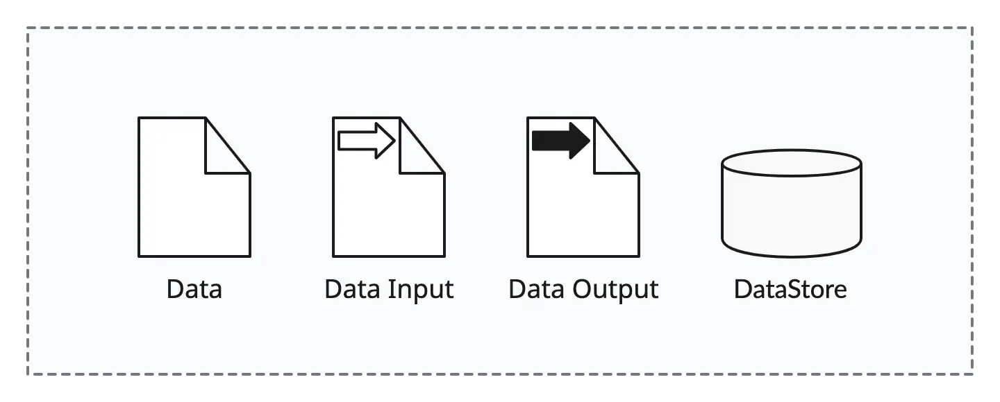
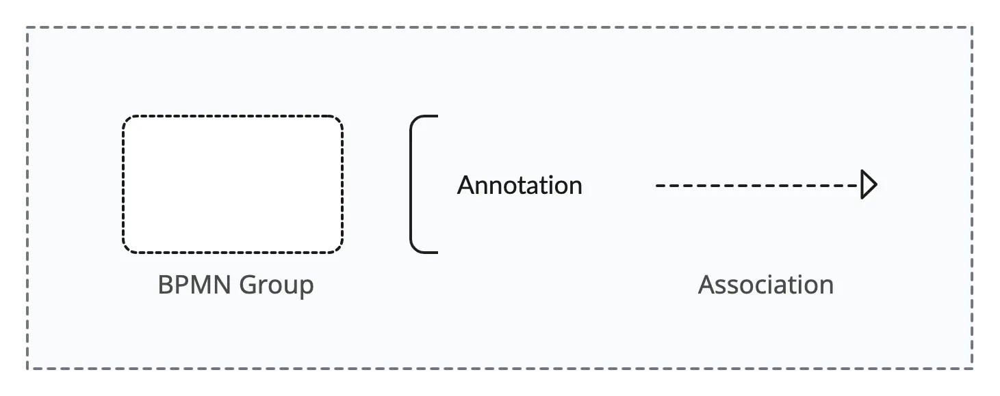
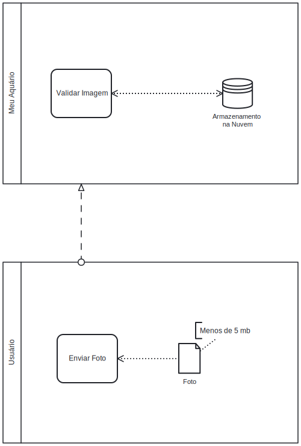

# 1.3.10. BPMN - Itens e Dados
## Introdução

Na modelagem BPMN (Business Process Model and Notation), os itens e dados são elementos essenciais para representar como a informação flui e é manipulada dentro de um processo de negócio. Eles ajudam a entender quais dados são necessários para executar atividades, como são armazenados e como são transmitidos entre participantes.

## Objetivo

O objetivo deste tópico é apresentar os conceitos de itens e dados na BPMN, demonstrando sua importância para:

- Rastreabilidade: Saber quais dados são usados em cada etapa.

- Integração: Entender como sistemas e participantes trocam informações.

- Persistência: Identificar onde os dados são armazenados.

- Documentação: Vincular documentos externos (como formulários e relatórios) ao processo.

## Tipos de Elementos de Dados em BPMN
### 1. Objetos de Dados (Data Objects)

Representam informações físicas ou digitais que são manipuladas no processo.

- Símbolo: (Retângulo com cantos dobrados, semelhante a um documento).

    Exemplos no "Meu Aquário":

        Dados do Usuário (informações de cadastro).

        Postagem no Feed (conteúdo compartilhado).

        Parâmetros de Qualidade da Água (dados de medição).
- Variações de Objetos de Dados

    - Data Input: Dados recebidos por uma atividade (seta para dentro).

    - Data Output: Dados produzidos por uma atividade (seta para fora).

    - Data Store: Dados armazenados (cilindro, explicado adiante).

### 2. Repositórios de Dados (Data Stores)

Indicam onde os dados são persistidos (banco de dados, arquivos, nuvem).

- Símbolo: (Cilindro, semelhante a um banco de dados).

    Exemplos no "Meu Aquário":

    - Banco de Dados de Usuários (armazena perfis).

Quando Usar?

    Quando uma atividade lê/grava em um armazenamento permanente.

    Para evitar repetição de objetos de dados em múltiplas atividades.

### 3. Fluxos de Dados (Data Associations)

Mostram como os dados são transferidos entre elementos.

- Símbolo: (Linha tracejada com seta).

    Exemplos:

        Um formulário de cadastro (Data Object) é enviado para a tarefa "Validar Dados".

        Os "Parâmetros da Água" são salvos no "Banco de Dados" (Data Store).

Regras de Uso

    Não substituem sequência ou mensagens (são complementares).

    Podem ser bidirecionais (se houver leitura e escrita).

### 4. Coleções de Dados (Data Collections)

Representam conjuntos de dados (ex.: listas, tabelas).

    Símbolo: (Objeto de dados com três linhas na parte inferior).

    Exemplo: "Histórico de Postagens" (várias postagens agrupadas).

### 5. Artefatos (Artifacts)

Elementos auxiliares que enriquecem a modelagem (sem impacto direto no fluxo).
Tipos Comuns

- Anotações (Text Annotations)

        Adicionam explicações (ex.: "Dados sensíveis, requer criptografia").

        Símbolo: (Retângulo com ponta virada).

    Grupos (Groups)

        Agrupam elementos relacionados visualmente (ex.: "Módulo de Cadastro").

        Símbolo:(Retângulo com borda tracejada).

### Símbolos:

### Exemplos Aplicados ao "Meu Aquário"

## Conclusão

Os itens e dados em BPMN são fundamentais para:
✅ Clareza: Mostram quais informações são necessárias em cada etapa.
✅ Eficiência: Evitam retrabalho ao definir fontes de dados únicas (Data Stores).
✅ Documentação: Vinculam regras e detalhes técnicos aos processos.

No contexto do "Meu Aquário", esses elementos ajudam a rastrear dados críticos, postagens de usuários, garantindo que o sistema funcione de forma integrada e bem documentada.