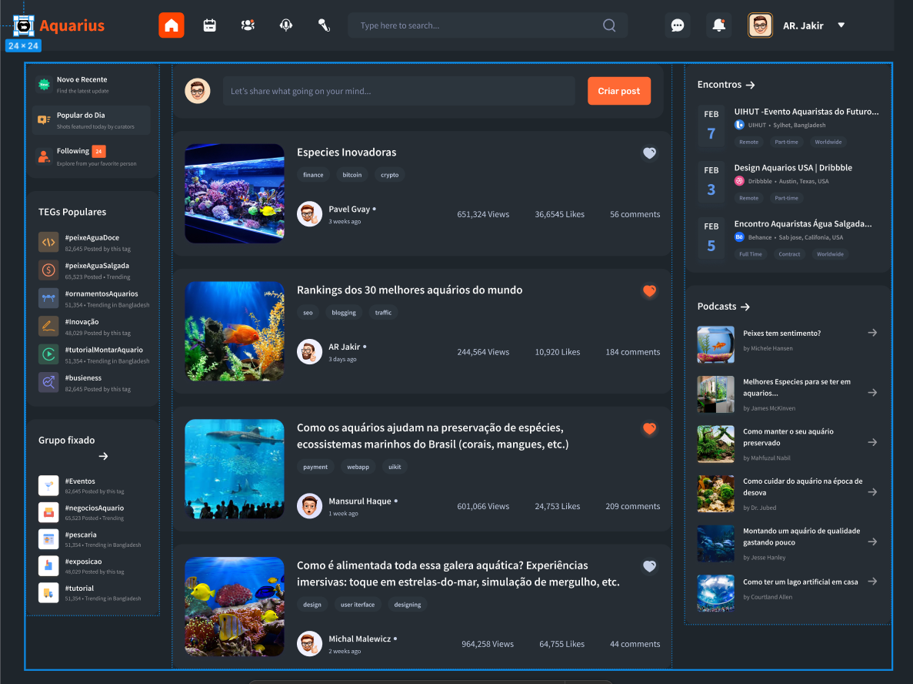

# Protótipo de Site – Aquarius

## Objetivo do Projeto

O objetivo deste protótipo é criar a estrutura de um site interativo e educativo para um aquário. A proposta é unir entretenimento, conscientização ambiental e educação científica em um ambiente digital moderno e acessível.

## Estrutura do Protótipo

O site é dividido em seções temáticas que proporcionam uma navegação fluida e intuitiva:

### 1. **Página Inicial (Home)**
- Destaques do aquário
- Chamada para visitação presencial
- Banner com vídeo de introdução subaquático
- Menu de navegação principal

### 2. **Conheça a Vida Marinha**
- Espécies em destaque (com fotos e curiosidades)
- Divisão por habitats (corais, águas profundas, manguezais, etc.)
- Filtros para navegação: carnívoros, herbívoros, ameaçados, etc.

### 3. **Conservação e Sustentabilidade**
- Ações do aquário em prol da natureza
- Projetos com ONGs e universidades
- Como o visitante pode ajudar: doações, adoções simbólicas, voluntariado

### 4. **Bastidores do Aquário**
- Tour virtual pelos bastidores
- Rotina dos cuidadores e biólogos
- Alimentação dos animais
- Tratamento e reabilitação de espécies

### 5. **Educação e Ciência**
- Conteúdo voltado para escolas
- Programas educativos e workshops
- Materiais didáticos para download
- Quiz e jogos interativos

### 6. **Eventos e Programações**
- Calendário de eventos
- Sessões de alimentação e interação ao vivo
- Noite no aquário: eventos especiais com realidade aumentada

### 7. **Blog / Temas de Discussão**
- Curiosidades sobre animais marinhos
- Notícias ambientais
- Entrevistas com biólogos e especialistas
- Mitos e verdades sobre os oceanos

### 8. **Contato e Visitação**
- Informações para agendamento
- Localização com mapa interativo
- Horários e preços
- Formulário para contato e dúvidas

## Proposta Visual

- Paleta de cores: tons de azul, verde-água e branco
- Estilo moderno com ilustrações e elementos animados
- Ícones temáticos e microinterações
- Layout responsivo (desktop, tablet e mobile)

## Tecnologias Sugeridas

- **Frontend**: HTML, CSS (Tailwind ou SCSS), JavaScript (ou framework como React ou Angular)
- **Protótipo UI/UX**: Figma
- **Back-end (em produção)**: Node.js, Python ou Java com banco de dados relacional
- **CMS/Blog**: Strapi ou WordPress headless

## Diferenciais

- Acessibilidade (uso de contraste, navegação por teclado)
- Experiências gamificadas para crianças
- Realidade aumentada integrada (em desenvolvimento)
- Inclusão de Libras em vídeos explicativos

## Protótipo

Você pode visualizar o protótipo do fórum clicando [aqui](https://www.figma.com/proto/Sg5Sm8Uw913hyS5KDWhF2I/Forum-UI-Design--Community-?node-id=5-1267&t=gJ4FGgDv7ekqMHMH-1&scaling=min-zoom&content-scaling=fixed&page-id=0%3A1&starting-point-node-id=5%3A1267).

## Considerações Finais

Este protótipo visa ir além de uma vitrine digital. É uma porta de entrada para o universo marinho, onde educação, tecnologia e sustentabilidade nadam juntas. A próxima fase envolve testes de usabilidade e integração com dados reais.

